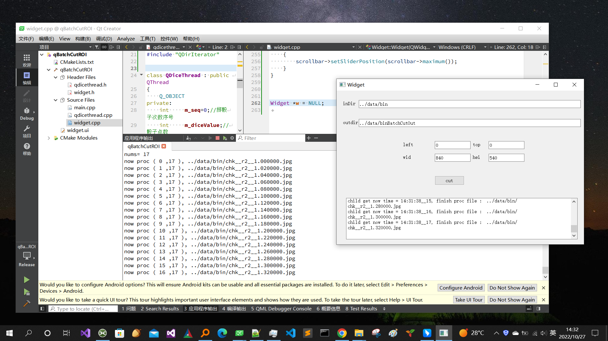

A simple multithreaded OpenCV example application using the Qt framework

批量裁剪一批图像的小工具。

利用qt5实现多线程。

利用opencv实现图像处理。

## Windows

### Visual Studio 2013

#### Environment

The build procedure has been tested and verified using:

- Windows 7 Ultimate Service Pack 1 64-bit
- Visual Studio 2013 Ultimate Update 5
- CMake 3.2.3: http://www.cmake.org/download/
- OpenCV 3.0.0: http://opencv.org/downloads.html
- Qt 5.5.0 (msvc2013_64): http://www.qt.io/download/

#### Preparation

Firstly, ensure the following are added to the Windows `PATH` variable (modified as required):

- CMake executable: `C:/Program Files (x86)/CMake/bin`
- Qt libraries (DLLs): `C:/Qt/Qt5.5.0/5.5/msvc2013_64/bin`
- OpenCV libraries (DLLs): `C:/Users/Nick/Desktop/opencv/build/x64/vc12`

#### Building

1. Create a build folder inside the top-level directory (this repository):
   `$ mkdir build`
2. Navigate to created folder:
   `$ cd build`
3. Run cmake (specify path to Qt installation and OpenCV and choose the desired Visual Studio generator):
   `$ cmake -D CMAKE_PREFIX_PATH=C:/Qt/Qt5.5.0/5.5/msvc2013_64 -D OpenCV_DIR=C:/Users/Nick/Desktop/opencv/build -G "Visual Studio 12 2013 Win64" ..`
4. Open generated *qt-opencv-multithreaded.sln* in Visual Studio 2013.
5. After opening the solution, ensure you right-hand click the *qt-opencv-multithreaded* project and choose "Set as StartUp Project" for correct running and debugging within Visual Studio.
6. Build the solution.

 程序截图：

